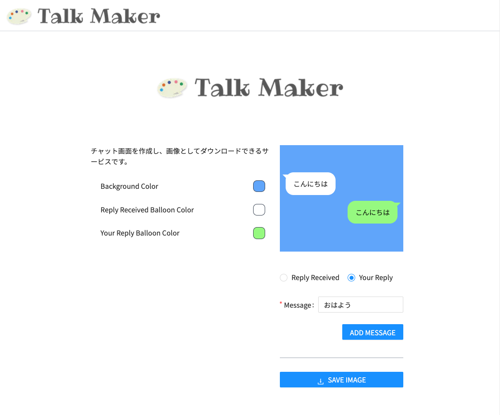

<p align="center">

</p>

---


<p align="center">
Talk Maker は、チャット画面を作成し、画像としてダウンロードできるサービスです。
</p>

<p align="center">

</p>

---

<p align="center">
<!-- ### Languages: -->


<!-- ### Linter -->


<!-- ### Frameworks -->


<!-- ### Infrastructure -->

</p>

# Features
- 色変更対応
- 絵文字対応

# Technologies
- Next.js
- TypeScript
- TailwindCSS
- html2canvas
- docker-compose (開発環境のみ)
- Vercel

# Support
- MacOS: Safari, Chrome, Firefox
- iOS: Safari
- Windows: Chrome, Edge (たぶん)

# Start Up
## development environment
```bash
docker-compose up
```


---

<h3 align="center">Development Tools</h3>
<p align="center">


</p>
